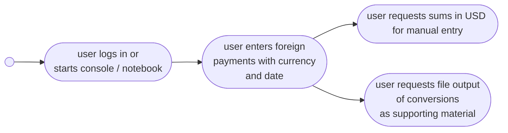

# expat-fatcat

`expat-fatcat` helps US taxpayers living abroad file their tax returns to comply with the IRS and [FATCA](https://en.wikipedia.org/wiki/Foreign_Account_Tax_Compliance_Act). A significant pain point in this process is that foreign payments (income or deductions) must sometimes be converted to USD with a valid rate on the date of payment. This can readily add up to 40+ historical FX-rates to look up and then paste into the usual Excel accounting madness. Some people may consider a little copy-paste drudge work once a year a minor annoyance, but what are programming and APIs for if not injecting some fun into an otherwise dreary task?

The core functionality of `expat-fatcat` is an historical FX-rate lookup with smoothing in case of a missing exchange rate. Currently, we use the FX-service [Quandl](https://www.quandl.com/) in `QuandlRateCoverterToUSD`, which is a sub-class of ``AbsRateConverterTo``. Other FX-rate services could be readily integrated as required.



## Installation

Install from [PyPI](https://pypi.org/) with `pip install expat-fatcat`.

## Example usage

```python
from expat_fatcat import QuandlRateConverterToUSD, FatcatCalculator
converter = QuandlRateConverterToUSD()
converter.get_rate('EUR', datetime(2019, 4, 18))
# 1.125
payments = [dict(date='2018-01-15', amount=100), dict(date='2018-02-15', amount=150)]
calculator = FatcatCalculator(converter)
calculator(payments, 'EUR', '%Y-%m-%d')
# 310.165
```

See also [notebooks/example-usage.ipynb](notebooks/example-usage.ipynb).

To make more than 50 API calls / day, save your Quandl API key in the environment variable `QUANDL_KEY`, and it will be used upon initialization of `QuandlRateConverterToUSD`.
